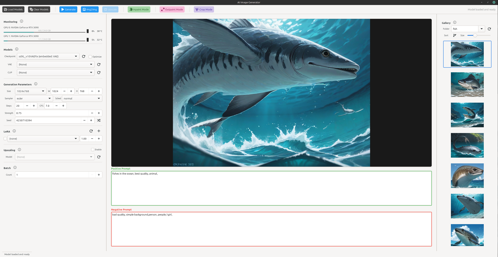

# AI Image Generator

A GTK 4 desktop application for AI image generation using Stable Diffusion, built with Python and the Hugging Face Diffusers library. Designed for Linux with multi-GPU support.



## Features

### Image Generation
- **Text-to-Image**: Generate images from text prompts using Stable Diffusion models
- **Image-to-Image (Img2Img)**: Transform existing images based on text prompts with adjustable strength
- **Inpainting**: Selectively regenerate parts of an image using rectangular or painted masks
- **Outpainting**: Extend images beyond their original borders in any direction (left, right, top, bottom)
- **Batch Generation**: Generate multiple images in sequence with automatic seed variation
- **Multi-GPU Support**: Parallel batch generation across multiple GPUs (e.g., 2x RTX 3090)

### Image Editing
- **Crop Mode**: Crop images to a selected region with preset sizes or custom dimensions
- **Remove with Mask**: Delete content under a mask and fill with blended colors from surrounding pixels
- **Mask Tools**: Draw rectangular masks, paint freehand masks, move and resize masks

### Model Support
- **SDXL and SD 1.5**: Supports both Stable Diffusion XL and SD 1.5 model architectures
- **Checkpoint Loading**: Load models from `.safetensors` or `.ckpt` files
- **VAE Support**: Use embedded VAE or load separate VAE models
- **LoRA Support**: Load and apply multiple LoRA models with adjustable weights
- **Upscaling**: 4x upscaling using Real-ESRGAN models (RealESRGAN_x4plus, RealESRGAN_x4plus_anime)

### Performance Optimization
- **torch.compile**: Optional model compilation with cached kernels for faster generation
  - Warning: First compilation takes many minutes depending on GPU
  - Only recommended for 50+ batch images on a single GPU
  - Does NOT work with Inpaint/Outpaint modes or multi-GPU batch generation
  - Each optimization is for a fixed resolution
- **xformers**: Memory-efficient attention when available
- **Prompt Caching**: Cached prompt embeddings for faster repeated generations
- **CUDA Optimizations**: cuDNN benchmark, TF32, channels_last memory format

### User Interface
- **Three-Panel Layout**: Model/parameters (left), image display (center), thumbnail gallery (right)
- **Resizable Panels**: Drag panel borders to customize layout
- **GPU Monitoring**: Real-time VRAM usage, GPU utilization percentage, and temperature display
- **Progress Tracking**: Step-by-step generation progress with cancel support
- **Metadata Preservation**: Generation parameters saved in PNG metadata and restored on load
- **Info System**: Click info icons next to section headers for detailed explanations; hover over labels for tooltips

## Generation Parameters

| Parameter | Range | Default | Description |
|-----------|-------|---------|-------------|
| Width | 256-2048 | 1024 | Image width (64px steps) |
| Height | 256-2048 | 1024 | Image height (64px steps) |
| Steps | 1-150 | 20 | Denoising steps |
| CFG Scale | 1.0-30.0 | 7.0 | Classifier-free guidance scale |
| Seed | -1 or 0+ | -1 | Random seed (-1 = random) |
| Strength | 0.0-1.0 | 0.75 | Img2Img/Inpaint transformation strength |

### Supported Samplers
- euler, euler_a
- heun
- dpm_2, dpm_2_a
- lms
- dpm++_2m, dpm++_2m_karras
- dpm++_sde, dpm++_sde_karras
- ddim, ddpm
- uni_pc, pndm

### Scheduler Types
- normal, simple, karras, exponential, sgm_uniform

## Keyboard Shortcuts

| Shortcut | Action |
|----------|--------|
| `Ctrl+Q` | Quit application |
| `Ctrl++` or `Ctrl+=` | Zoom in (image display) |
| `Ctrl+-` | Zoom out (image display) |
| `Ctrl+0` | Reset zoom to fit window |
| `R` | Reset zoom to fit window |
| `0` | Reset zoom to fit window |
| `Delete` or `Backspace` | Delete selected image from gallery |

## Mouse Controls

### Image Display - Zoom
| Action | Effect |
|--------|--------|
| Scroll Up | Zoom in (centered on cursor position) |
| Scroll Down | Zoom out (centered on cursor position) |

- Zoom range: 10% to 2000%
- Zoom indicator appears in the corner when zoomed

### Image Display - Pan
| Action | Effect |
|--------|--------|
| Middle Mouse Button + Drag | Pan the image when zoomed in |

### Inpaint Mode - Mask Drawing
| Action | Effect |
|--------|--------|
| Left Click + Drag (Rect Mask tool) | Draw rectangular mask |
| Left Click + Drag (Paint Mask tool) | Paint circular mask (25px brush) |

- Masks appear as semi-transparent red overlay
- White areas in mask = regions to regenerate
- Black areas in mask = regions to preserve

### Outpaint Mode - Edge Selection
| Action | Effect |
|--------|--------|
| Left Click on edge | Toggle edge mask for that side |

- Edge masks appear as pink overlays on image borders
- Multiple edges can be selected simultaneously
- Use directional buttons (Left/Right/Top/Bottom) to extend

### Crop Mode - Mask Drawing and Editing
| Action | Effect |
|--------|--------|
| Left Click + Drag | Draw crop rectangle |
| Left Click inside mask + Drag | Move the crop region |
| Left Click on corner + Drag | Resize the crop region |

- Crop mask appears as semi-transparent purple overlay
- Tooltip shows dimensions while drawing/resizing
- Use size presets dropdown for quick sizing

## Toolbar Buttons

### Model Management
- **Load Models**: Load selected checkpoint, VAE, and apply optimizations
- **Clear Models**: Unload all models and free VRAM

### Generation
- **Generate**: Create new image from text prompt
- **Img2Img**: Transform current image based on prompt
- **Upscale**: Upscale current image using Real-ESRGAN (when enabled)

### Inpaint Mode (appears when image is loaded)
- **Inpaint Mode**: Toggle inpaint editing mode
- **Rect Mask**: Draw rectangular selection masks
- **Paint Mask**: Paint freehand masks with brush
- **Clear Masks**: Remove all drawn masks
- **Generate Inpaint**: Regenerate masked areas

### Outpaint Mode (appears when image is loaded)
- **Outpaint Mode**: Toggle outpaint editing mode
- **Edge Mask**: Click on image edges to mark for extension
- **Clear Masks**: Remove all edge masks
- **Left/Right/Top/Bottom**: Extend image in the selected direction
- Outpaint generates new content beyond the original image borders with smooth blending

### Crop Mode (appears when image is loaded)
- **Crop Mode**: Toggle crop editing mode
- **Crop Mask**: Draw a rectangular crop region
- **Clear Mask**: Remove the crop selection
- **Crop Image**: Crop the image to the selected region
- **Remove with Mask**: Fill the masked area with blended colors from surrounding pixels
- **Size Presets**: Quick selection of common crop sizes (1024x1024, 1152x896, etc.)
- Crop masks can be moved (drag inside) and resized (drag corners)

## Configuration

Configuration is stored in `~/.aiimagegen/config.yaml`:

```yaml
version: "1.0"
directories:
  models: "./models"
  output: "./output"
generation:
  default_width: 1024
  default_height: 1024
  default_sampler: "euler"
  default_scheduler: "normal"
  default_steps: 20
  default_cfg_scale: 7.0
  default_seed: -1
```

## Directory Structure

```
models/
├── checkpoints/     # Stable Diffusion model files (.safetensors, .ckpt)
├── vae/             # VAE model files
├── lora/            # LoRA model files
├── upscale/         # Real-ESRGAN upscaler models
└── compiled/        # Cached torch.compile kernels

output/              # Generated images (organized in subdirectories)
```

## Requirements

- Python 3.12+
- GTK 4 / PyGObject
- PyTorch with CUDA support
- NVIDIA GPU with CUDA capability

### Python Dependencies
- PyGObject >= 3.46.0
- torch >= 2.1.0
- diffusers >= 0.27.0
- transformers >= 4.38.0
- accelerate >= 0.27.0
- safetensors >= 0.4.0
- Pillow >= 10.0.0
- PyYAML >= 6.0
- nvidia-ml-py >= 11.5.0
- xformers (optional, for memory-efficient attention)

## Installation

```bash
# Clone the repository
git clone <repository-url>
cd ai-image-generator

# Create virtual environment
python -m venv .venv
source .venv/bin/activate

# Install dependencies
pip install -r requirements.txt

# Run the application
python main.py
```

## First Launch

1. On first launch, the Setup Screen appears
2. Configure paths for models and output directories
3. Select which GPUs to use (if multiple available)
4. Click "Save & Continue" to enter the main workspace

## Usage Tips

- **Auto Model Loading**: Clicking Generate/Img2Img will automatically load models if not already loaded
- **Metadata Restoration**: Clicking a thumbnail restores all generation parameters from that image
- **Batch + Optimize**: For single-GPU batch, enable Optimize for faster generation. Multi-GPU batch disables optimization due to CUDA graph conflicts
- **Gallery Navigation**: Use the directory dropdown in the gallery panel to organize outputs into subdirectories
- **LoRA Stacking**: Multiple LoRAs can be active simultaneously with individual weight controls
- **Outpaint Chaining**: You can outpaint multiple times to progressively extend an image in any direction
- **Crop Mode**: Use size presets for quick cropping to standard dimensions, or draw custom regions
- **Remove with Mask**: Great for removing unwanted objects - fills with blended colors from the edges
- **Mode Switching**: Modes are mutually exclusive - enabling one mode automatically disables others
- **Info Icons**: Click the info icon (ⓘ) next to any section header for detailed help
- **Label Tooltips**: Hover over parameter labels for 1 second to see explanations

## License

MIT License
